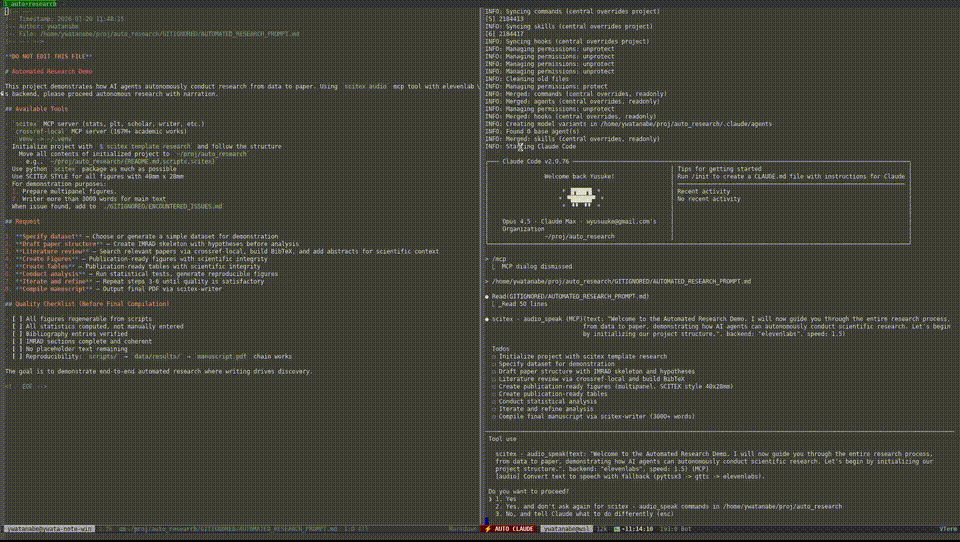

  

  <strong>Automating Scientific Workflows with Human-in-the-Environment AI Integration</strong>

  <a href="https://scitex.ai">scitex.ai</a> |
  <a href="https://pypi.org/project/scitex/">pip install scitex</a>

---

  
   
  <a href="https://scitex.ai/demos/watch/scitex-automated-research/">▶ Watch Full Demo</a>

---

## SciTeX Ecosystem

| Component | Description | Repository |
|-----------|-------------|------------|
|  **SciTeX-Python** | Unified Python framework with 30+ modules for scientific workflows | [scitex-python](https://github.com/ywatanabe1989/scitex-code) |
| **SciTeX-Engine** | Human-in-the-environment AI collaboration platform using Emacs | [emacs-claude-code](https://github.com/ywatanabe1989/emacs-claude-code) |
| **SciTeX-Cloud** | Django-based cloud platform for SciTeX | [scitex-cloud](https://github.com/ywatanabe1989/scitex-cloud) |
| **SciTeX-Writer** | Organized LaTeX compilation with predefined structures | [scitex-writer](https://github.com/ywatanabe1989/scitex-writer) |

### Modules in SciTeX-Python (pip install scitex)

| Category | Modules |
|----------|---------|
| **Core** | io, path, str, dict, types, config, utils, decorators, logging, gen |
| **Data Science** | stats, pd, linalg, plt, dsp |
| **AI/ML** | ai, nn, torch |
| **System** | cli, sh, git, session, resource, db |
| **Research** | writer, tex, msword, scholar, diagram |
| **Web** | web, browser |
| **Other** | audio, capture, repro, benchmark, security, dt, dev, schema, bridge |

> Previously separate packages (SciTeX-Viz, SciTeX-Scholar, SciTeX-IO, etc.) are now consolidated into the unified `scitex` package.

---

## Scientific Research Projects

| Project | Description |
|---------|-------------|
| [EEG Dementia Classification](https://github.com/yanagisawa-lab/eeg-dementia-classification) | Dementia subtypes and MCI detection using EEG data |
| [Hippocampal Ripple Detector](https://github.com/ywatanabe1989/towards-threshold-invariance-in-defining-hippocampal-ripples) | CNN-based sharp-wave ripples detector ([pip](https://github.com/ywatanabe1989/ripple_detector_CNN)) |
| [Ripple Working Memory](https://github.com/ywatanabe1989/ripple-wm-code) | Sharp-wave ripples during working memory in humans |
| [GPAC](https://github.com/ywatanabe1989/gpac) | GPU-accelerated phase-amplitude coupling |
| [Intestelligence](https://github.com/ywatanabe1989/intestelligence) | Pharmacological neural network using intestine data |

---

## Emacs Packages

| Category | Package | Description |
|----------|---------|-------------|
| **AI** | [emacs-claude-code](https://github.com/ywatanabe1989/emacs-claude-code) | Claude Code integration (SciTeX-Engine) |
| | [emacs-llm](https://github.com/ywatanabe1989/emacs-llm) | LLM chat client in Elisp |
| | [genai](https://github.com/ywatanabe1989/genai) | LLM chat (Python + Elisp) |
| | [emacs-whisper-live](https://github.com/ywatanabe1989/emacs-whisper-live) | Real-time speech recognition |
| **Dev** | [elisp-test](https://github.com/ywatanabe1989/elisp-test) | Testing framework for Elisp |
| | [elisp-linter](https://github.com/ywatanabe1989/elisp-linter) | Linter for Elisp |
| | [emacs-python-import-manager](https://github.com/ywatanabe1989/emacs-python-import-manager) | Python import management |
| **UI** | [emacs-tab-manager](https://github.com/ywatanabe1989/emacs-tab-manager) | Tab management |
| | [emacs-buffer-navigation](https://github.com/ywatanabe1989/emacs-buffer-navigation) | Buffer navigation |
| | [emacs-spinner](https://github.com/ywatanabe1989/emacs-spinner) | Spinner animations |
| **Tools** | [emacs-header-footer-manager](https://github.com/ywatanabe1989/emacs-header-footer-manager) | Header/footer management |
| | [emacs-slack](https://github.com/ywatanabe1989/emacs-slack) | Slack integration |
| | [emacs-message](https://github.com/ywatanabe1989/emacs-message) | Toggle print/message |
| | [emacs-gif-screencast](https://github.com/ywatanabe1989/emacs-gif-screencast) | GIF screencast & capture |

---

## Resources

- [.dotfiles-public](https://github.com/ywatanabe1989/.dotfiles-public) - Linux configuration
- [ai-ielts.app](https://ai-ielts.app/) - IELTS speaking/writing practice
- [Programming advice (EN)](./advice-for-my-younger-myself-en.md) | [(JA)](./advice-for-my-younger-myself-ja.md)

---

  
   
  <a href="https://scitex.ai">scitex.ai</a>

