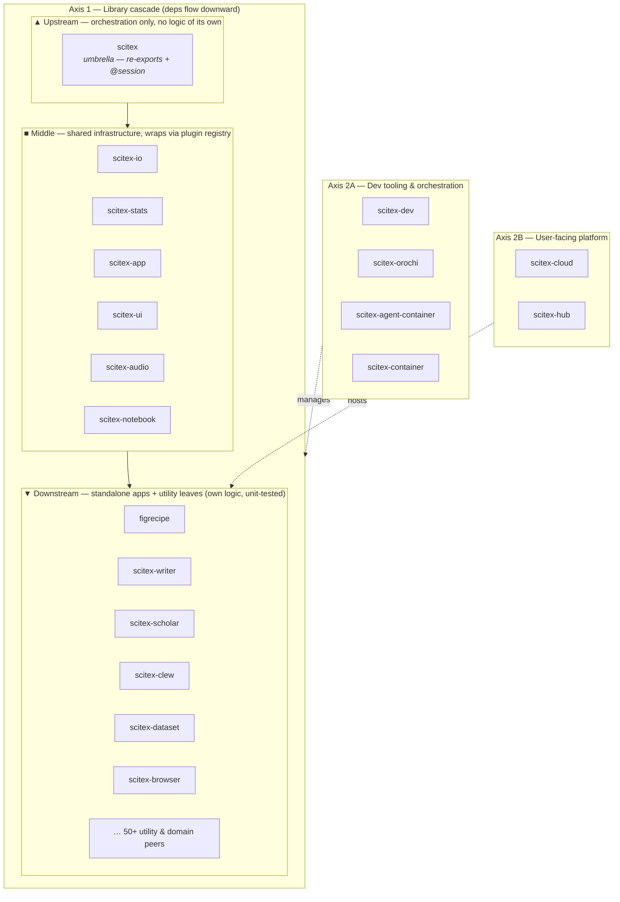

<!-- ---
!-- Timestamp: 2026-06-10
!-- Author: ywatanabe
!-- File: /home/ywatanabe/proj/ywatanabe1989/README.md
!-- --- -->

## SciTeX Ecosystem

  

  <a href="https://scitex.ai">scitex.ai</a> |
  <a href="https://pypi.org/project/scitex/">pip install scitex</a>

(Demo) Automated Research with SciTeX MCP Server in 40 min. Literature Search → Analysis → Graphing → Manuscript → Revision Letter

  

---

| Component | Description | Repository |
|-----------|-------------|------------|
| **SciTeX-Python** | Modular Python toolkit for scientific research with 200+ MCP tools | [scitex-python](https://github.com/ywatanabe1989/scitex-python) |
| **SciTeX-Engine** | Emacs interface for Claude Code with auto-response, vterm integration, and session management | [emacs-claude-code](https://github.com/ywatanabe1989/emacs-claude-code) |
| **SciTeX-Cloud** | Django-based, self-hostable browser application for scientific research | [scitex-cloud](https://github.com/ywatanabe1989/scitex-cloud) |

### Architecture — two orthogonal axes

The ecosystem is organised as a strict 3-layer library cascade (Axis 1) plus orthogonal dev-tooling and platform packages (Axis 2). Dependencies flow one way only — upstream imports middle imports downstream, never the reverse. Full rules in [scitex-dev `01_upstream-and-downstream` skill](https://github.com/ywatanabe1989/scitex-dev/blob/main/src/scitex_dev/_skills/general/01_ecosystem/01_upstream-and-downstream.md).

```mermaid
flowchart TD
    subgraph CASCADE ["Axis 1 — Library cascade (deps flow downward)"]
        direction TB

        subgraph UP ["▲ Upstream — orchestration only, no logic of its own"]
            U["scitex<br/><i>umbrella — re-exports + @session</i>"]
        end

        subgraph MID ["■ Middle — shared infrastructure, wraps via plugin registry"]
            M1[scitex-io]
            M2[scitex-stats]
            M3[scitex-app]
            M4[scitex-ui]
            M5[scitex-audio]
            M6[scitex-notebook]
        end

        subgraph DOWN ["▼ Downstream — standalone apps + utility leaves (own logic, unit-tested)"]
            D1[figrecipe]
            D2[scitex-writer]
            D3[scitex-scholar]
            D4[scitex-clew]
            D5[scitex-dataset]
            D6[scitex-browser]
            D7["… 50+ utility &amp; domain peers"]
        end

        UP --> MID --> DOWN
    end

    subgraph AX2A ["Axis 2A — Dev tooling &amp; orchestration"]
        T1[scitex-dev]
        T2[scitex-orochi]
        T3[scitex-agent-container]
        T4[scitex-container]
    end

    subgraph AX2B ["Axis 2B — User-facing platform"]
        P1[scitex-cloud]
        P2[scitex-hub]
    end

    AX2A -. manages .-> CASCADE
    AX2B -. hosts .-> DOWN
```

<b>Downstream, Standalone Packages</b> (67 packages on PyPI)

Standalone packages usable independently or via the unified `scitex` umbrella. Each row's **scitex Module** column shows the alias the package mounts under (`import scitex.<short>`); a few peers carry more than one alias because they absorbed an earlier standalone.

**I/O & data**

| Package | scitex Module | Description |
|---------|---------------|-------------|
| [scitex-io](https://github.com/ywatanabe1989/scitex-io) | `scitex.io` | Universal scientific data I/O with plugin registry (30+ formats) |
| [scitex-db](https://github.com/ywatanabe1989/scitex-db) | `scitex.db` | Database utilities for SQLite3 and PostgreSQL |
| [scitex-pd](https://github.com/ywatanabe1989/scitex-pd) | `scitex.pd` | Pandas helpers (force_df, melt_cols, find_pval, slice, sort, …) |
| [scitex-dataset](https://github.com/ywatanabe1989/scitex-dataset) | `scitex.dataset` | Multi-domain scientific dataset fetcher (OpenNeuro, DANDI, PhysioNet, GEO, ChEMBL, ClinicalTrials) |
| [scitex-msword](https://github.com/ywatanabe1989/scitex-msword) | `scitex.msword` | `.docx` reader/writer with journal-style profiles (MDPI, IEEE, Springer, Elsevier, RESNA, IOP) |
| [scitex-notebook](https://github.com/ywatanabe1989/scitex-notebook) | `scitex.notebook` | Jupyter notebook verification, compilation, and DAG-based conversion |
| [scitex-tex](https://github.com/ywatanabe1989/scitex-tex) | `scitex.tex` | LaTeX helpers — export to `.tex`, render preview images, vector formatting |

**Statistics, ML, signals & math**

| Package | scitex Module | Description |
|---------|---------------|-------------|
| [scitex-stats](https://github.com/ywatanabe1989/scitex-stats) | `scitex.stats` | Publication-ready statistical testing with 23 tests, effect sizes, power analysis |
| [scitex-ml](https://github.com/ywatanabe1989/scitex-ml) | `scitex.ml` | Machine learning, classification, and training utilities |
| [scitex-nn](https://github.com/ywatanabe1989/scitex-nn) | `scitex.nn` | Neural network building blocks (BNet, Hilbert, PAC, Wavelet, filters) |
| [scitex-dsp](https://github.com/ywatanabe1989/scitex-dsp) | `scitex.dsp` | Digital signal processing (PAC, Hilbert, Wavelet, filters, demo signals) |
| [scitex-linalg](https://github.com/ywatanabe1989/scitex-linalg) | `scitex.linalg`, `scitex.torch` | Linear-algebra helpers (distance, geometric median, cosine, nannorm) |
| [scitex-math](https://github.com/ywatanabe1989/scitex-math) | `scitex.math` | Mathematical utilities (parity helpers, etc.) |
| [scitex-benchmark](https://github.com/ywatanabe1989/scitex-benchmark) | `scitex.benchmark` | Performance benchmarking, runtime monitoring, and profiling |

**Visualization**

| Package | scitex Module | Description |
|---------|---------------|-------------|
| [figrecipe](https://github.com/ywatanabe1989/figrecipe) | `scitex.plt`, `scitex.fig`, `scitex.diagram` | Reproducible, publication-ready matplotlib with mm-precision layouts and 47 plot types |
| [scitex-plt](https://github.com/ywatanabe1989/scitex-plt) | `scitex.plt` | Plotting alias for `figrecipe` |
| [scitex-cv](https://github.com/ywatanabe1989/scitex-cv) | `scitex.cv` | cv2/Pillow image processing (load/save, resize/rotate/crop, blur/sharpen/edge, drawing) |
| [scitex-capture](https://github.com/ywatanabe1989/scitex-capture) | `scitex.capture` | Session-based screen capture (screenshots, multi-frame GIFs, grid overlays) |

**Scholarly literature & writing**

| Package | scitex Module | Description |
|---------|---------------|-------------|
| [scitex-scholar](https://github.com/ywatanabe1989/scitex-scholar) | `scitex.scholar` | Scientific paper search, enrichment, download, and management |
| [crossref-local](https://github.com/ywatanabe1989/crossref-local) | `scitex.scholar.crossref` | Local CrossRef database with 167M+ works and full-text search |
| [openalex-local](https://github.com/ywatanabe1989/openalex-local) | `scitex.scholar.openalex` | Local OpenAlex database with 284M+ works and semantic search |
| [scitex-writer](https://github.com/ywatanabe1989/scitex-writer) | `scitex.writer` | LaTeX manuscript compilation with automatic versioning and diff generation |
| [scitex-web](https://github.com/ywatanabe1989/scitex-web) | `scitex.web` | Web scraping, PubMed search, URL summarization helpers |
| [scitex-browser](https://github.com/ywatanabe1989/scitex-browser) | `scitex.browser` | Browser automation for scholarly paper access |

**Knowledge & domain**

| Package | scitex Module | Description |
|---------|---------------|-------------|
| [scitex-clew](https://github.com/ywatanabe1989/scitex-clew) | `scitex.clew` | Verifiable knowledge graph for scientific experiments |
| [scitex-seizure-metrics](https://github.com/ywatanabe1989/scitex-seizure-metrics) | `scitex.seizure_metrics` | Standardised evaluation metrics for epileptic seizure detection and forecasting |

**Systems, infrastructure & ops**

| Package | scitex Module | Description |
|---------|---------------|-------------|
| [scitex-container](https://github.com/ywatanabe1989/scitex-container) | `scitex.container` | Unified container management for Apptainer and Docker |
| [scitex-ssh](https://github.com/ywatanabe1989/scitex-ssh) | `scitex.ssh`, `scitex.tunnel` | SSH primitives (exec/copy/attach/tunnel) with per-host allowlist |
| [scitex-hpc](https://github.com/ywatanabe1989/scitex-hpc) | `scitex.hpc` | Generic SLURM dispatch (srun, sbatch, sync, poll, fetch) |
| [scitex-hub](https://github.com/ywatanabe1989/scitex-hub) | `scitex.cloud`, `scitex.module`, `scitex.project` | SciTeX Hub deployment and management CLI |
| [scitex-app](https://github.com/ywatanabe1989/scitex-app) | `scitex.app` | Write-once interface for local + cloud apps |
| [scitex-ui](https://github.com/ywatanabe1989/scitex-ui) | `scitex.ui` | Shared frontend UI components for the ecosystem |
| [scitex-audit](https://github.com/ywatanabe1989/scitex-audit) | `scitex.audit` | Security audit orchestrator (bandit, shellcheck, pip-audit, GitHub alerts) |
| [scitex-notification](https://github.com/ywatanabe1989/scitex-notification) | `scitex.notification`, `scitex.notify` | Multi-backend notification system |
| [scitex-agent-container](https://github.com/ywatanabe1989/scitex-agent-container) | `scitex.agent_container` | Declarative YAML framework for managing AI coding agent instances |
| [scitex-orochi](https://github.com/ywatanabe1989/scitex-orochi) | `scitex.orochi` | Agent communication hub |

**Developer workflow**

| Package | scitex Module | Description |
|---------|---------------|-------------|
| [scitex-dev](https://github.com/ywatanabe1989/scitex-dev) | `scitex.dev` | Shared developer utilities and AST linter (absorbs `scitex-linter`) |
| [scitex-template](https://github.com/ywatanabe1989/scitex-template) | `scitex.template` | Project template cloner + code snippet library |
| [scitex-config](https://github.com/ywatanabe1989/scitex-config) | `scitex.config` | Configuration + path management (direct → yaml → env → default cascade) |
| [scitex-logging](https://github.com/ywatanabe1989/scitex-logging) | `scitex.logging`, `scitex.errors` | Logging utilities |
| [scitex-events](https://github.com/ywatanabe1989/scitex-events) | `scitex.events` | Async event bus (file-backed, JSON Lines) |
| [scitex-decorators](https://github.com/ywatanabe1989/scitex-decorators) | `scitex.decorators` | numpy/torch/pandas/xarray type converters, caching, batching, deprecation |
| [scitex-types](https://github.com/ywatanabe1989/scitex-types) | `scitex.types` | Scientific type definitions (ArrayLike, ColorLike) and validation |
| [scitex-path](https://github.com/ywatanabe1989/scitex-path) | `scitex.path` | Scientific project path utilities (find, split, symlink, versioning) |
| [scitex-repro](https://github.com/ywatanabe1989/scitex-repro) | `scitex.repro` | Reproducibility utilities (random state, timestamps, hashing) |
| [scitex-introspect](https://github.com/ywatanabe1989/scitex-introspect) | `scitex.introspect` | IPython-style introspection (signatures, members, source, call graphs) |
| [scitex-context](https://github.com/ywatanabe1989/scitex-context) | `scitex.context` | Execution-context detection (script vs Jupyter vs IPython) + stdout/stderr suppression |
| [scitex-session](https://github.com/ywatanabe1989/scitex-session) | `scitex.session` | `@session` decorator + lifecycle (auto-CLI, output dir tree, RandomStateManager) |
| [scitex-compat](https://github.com/ywatanabe1989/scitex-compat) | `scitex.compat` | Backward compatibility shims and deprecation wrappers |
| [scitex-core](https://github.com/ywatanabe1989/scitex-core) | `scitex.core` | Core infrastructure and fundamental utilities |
| [scitex-parallel](https://github.com/ywatanabe1989/scitex-parallel) | `scitex.parallel` | Thread/process pool parallel execution utilities |
| [scitex-repl](https://github.com/ywatanabe1989/scitex-repl) | `scitex.repl` | Interactive REPL helpers (embed, less, paste) |
| [scitex-resource](https://github.com/ywatanabe1989/scitex-resource) | `scitex.resource` | System resource info, processor usage logging, RAM limit |
| [scitex-git](https://github.com/ywatanabe1989/scitex-git) | `scitex.git` | Git + GitHub Actions utilities (clone, branch, commit, retry, gh secrets) |
| [scitex-todo](https://github.com/ywatanabe1989/scitex-todo) | `scitex.todo` | Canonical YAML task store with pluggable adapters (mermaid dependency graphs) |
| [scitex-genai](https://github.com/ywatanabe1989/scitex-genai) | `scitex.genai` | Modality-organised generative-AI provider abstraction (LLM, agents, image/audio/video) |

**Text, dates & misc utilities**

| Package | scitex Module | Description |
|---------|---------------|-------------|
| [scitex-str](https://github.com/ywatanabe1989/scitex-str) | `scitex.str` | Text processing (LaTeX formatting, colored output, string parsing, plot text) |
| [scitex-dict](https://github.com/ywatanabe1989/scitex-dict) | `scitex.dict` | Dictionary utilities (DotDict, safe_merge) |
| [scitex-gen](https://github.com/ywatanabe1989/scitex-gen) | `scitex.gen` | General utilities (caching, env detection, normalization, mat→npy, xml→dict, TimeStamper) |
| [scitex-etc](https://github.com/ywatanabe1989/scitex-etc) | `scitex.etc`, `scitex.media` | Cross-cutting utilities (interactive keyboard input, parameter-grid iteration, regex, media display) |
| [scitex-datetime](https://github.com/ywatanabe1989/scitex-datetime) | `scitex.datetime` | Datetime helpers (linspace, normalize_timestamp, format helpers) |
| [scitex-gists](https://github.com/ywatanabe1989/scitex-gists) | `scitex.gists` | SigmaPlot macro conversion utilities for matplotlib |
| [scitex-audio](https://github.com/ywatanabe1989/scitex-audio) | `scitex.audio` | Text-to-Speech with multiple backends |
| [scitex-os](https://github.com/ywatanabe1989/scitex-os) | `scitex.os` | Host check + safe file move |
| [scitex-sh](https://github.com/ywatanabe1989/scitex-sh) | `scitex.sh` | Safe subprocess wrapper (list-only, no shell injection) with stream/timeout support |

**Social & meta-tooling**

| Package | scitex Module | Description |
|---------|---------------|-------------|
| [socialia](https://github.com/ywatanabe1989/socialia) | `scitex.social` | Unified social media management (posting, analytics, insights) |
| [newb](https://github.com/ywatanabe1989/newb) | — | "A fresh AI agent tries to use your package" — pytest-style; if it succeeds, your docs work |

---

## Scientific Research Projects

| Title | Code |
|-------|------|
| A deep learning model for the detection of various dementia and MCI pathologies based on resting-state electroencephalography data | [eeg-dementia-classification](https://github.com/yanagisawa-lab/eeg-dementia-classification) |
| Towards threshold invariance in defining hippocampal ripples | [Code](https://github.com/ywatanabe1989/towards-threshold-invariance-in-defining-hippocampal-ripples), [pip](https://github.com/ywatanabe1989/ripple_detector_CNN) |
| Hippocampal neural fluctuations during working memory | [ripple-wm-code](https://github.com/ywatanabe1989/ripple-wm-code) |
| gPAC: GPU-accelerated phase-amplitude coupling analysis (341x faster than TensorPAC) | [gPAC](https://github.com/ywatanabe1989/gPAC) |
| Intestelligence: A pharmacological neural network using intestine data | [intestelligence](https://github.com/ywatanabe1989/intestelligence) |

---

## Emacs Packages

| Category | Package | Description |
|----------|---------|-------------|
| **AI** | [emacs-claude-code](https://github.com/ywatanabe1989/emacs-claude-code) | Claude Code integration (SciTeX-Engine) |
| | [emacs-llm](https://github.com/ywatanabe1989/emacs-llm) | LLM chat client in Elisp |
| | [genai](https://github.com/ywatanabe1989/genai) | LLM chat interface with streaming and conversation history |
| | [emacs-whisper-live](https://github.com/ywatanabe1989/emacs-whisper-live) | Real-time speech transcription with Whisper |
| | [emacs-mcp-server](https://github.com/ywatanabe1989/emacs-mcp-server) | MCP server for Emacs |
| **Dev** | [elisp-test](https://github.com/ywatanabe1989/elisp-test) | Testing framework for Elisp |
| | [elisp-linter](https://github.com/ywatanabe1989/elisp-linter) | Linter for Elisp |
| | [emacs-python-import-manager](https://github.com/ywatanabe1989/emacs-python-import-manager) | Python import management |
| | [emacs-python-config](https://github.com/ywatanabe1989/emacs-python-config) | Python environment configuration |
| **UI** | [emacs-tab-manager](https://github.com/ywatanabe1989/emacs-tab-manager) | Tab management |
| | [emacs-buffer-navigation](https://github.com/ywatanabe1989/emacs-buffer-navigation) | Buffer navigation |
| | [emacs-recentf-project](https://github.com/ywatanabe1989/emacs-recentf-project) | Project-aware recent files |
| | [emacs-spinner](https://github.com/ywatanabe1989/emacs-spinner) | Spinner animations |
| **Tools** | [emacs-header-footer-manager](https://github.com/ywatanabe1989/emacs-header-footer-manager) | Header/footer management |
| | [emacs-slack](https://github.com/ywatanabe1989/emacs-slack) | Slack integration |
| | [emacs-message](https://github.com/ywatanabe1989/emacs-message) | Toggle print/message |
| | [emacs-gif-screencast](https://github.com/ywatanabe1989/emacs-gif-screencast) | GIF screencast & capture |
| | [emacs-password-manager](https://github.com/ywatanabe1989/emacs-password-manager) | GPG-encrypted password manager |

---

## Resources

| Resource | Description |
|----------|-------------|
| [agents](https://github.com/ywatanabe1989/agents) | Sync MCP servers, skills, and instructions across AI coding tools |
| [automated-research-demo](https://github.com/ywatanabe1989/automated-research-demo) | Demo: AI-driven autonomous research from data to manuscript |
| [.dotfiles-public](https://github.com/ywatanabe1989/.dotfiles-public) | Linux configuration |
| [ai-ielts.app](https://ai-ielts.app/) | IELTS speaking/writing practice |
| [Programming advice (EN)](./docs/advice-for-my-younger-myself-en.md) / [(JA)](./docs/advice-for-my-younger-myself-ja.md) | Tips for younger self |

---

  
   
  ywatanabe@scitex.ai

<!-- EOF -->
