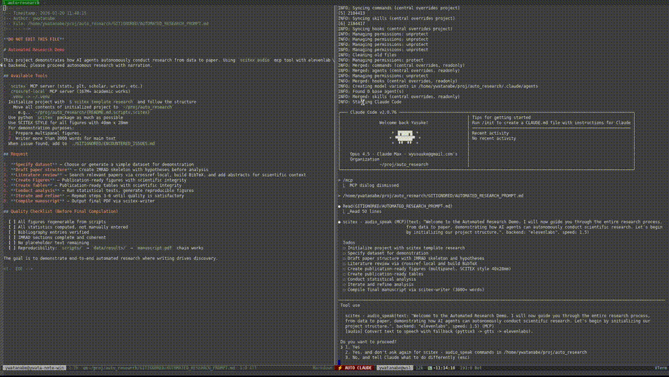

<!-- ---
!-- Timestamp: 2026-02-02 05:06:24
!-- Author: ywatanabe
!-- File: /home/ywatanabe/proj/ywatanabe1989/README.md
!-- --- -->

  

  <a href="https://scitex.ai">scitex.ai</a> |
  <a href="https://pypi.org/project/scitex/">pip install scitex</a>

---

  

---

## SciTeX Ecosystem

| Component | Description | Repository |
|-----------|-------------|------------|
| **SciTeX-Python** | Unified Python framework with 30+ modules for scientific workflows | [scitex-python](https://github.com/ywatanabe1989/scitex-python) |
| **SciTeX-Engine** | Human-in-the-environment AI collaboration platform using Emacs | [emacs-claude-code](https://github.com/ywatanabe1989/emacs-claude-code) |
| **SciTeX-Cloud** | Django-based cloud platform for SciTeX | [scitex-cloud](https://github.com/ywatanabe1989/scitex-cloud) |

<b>Integrated Packages</b>

Standalone packages usable independently or via unified `scitex` interface.

| Package | scitex Module | Description |
|---------|---------------|-------------|
| [figrecipe](https://github.com/ywatanabe1989/figrecipe) | `scitex.plt` | Publication-ready matplotlib figures |
| [scitex-writer](https://github.com/ywatanabe1989/scitex-writer) | `scitex.writer` | Organized LaTeX manuscript compilation |
| [crossref-local](https://github.com/ywatanabe1989/crossref-local) | `scitex.scholar.crossref` | Local CrossRef database (167M+ papers) |
| [openalex-local](https://github.com/ywatanabe1989/openalex-local) | `scitex.scholar.openalex` | Local OpenAlex database (250M+ papers) |
| [socialia](https://github.com/ywatanabe1989/socialia) | `scitex.social` | Social media posting (Twitter, LinkedIn) |

---

## Scientific Research Projects

| Title | Code |
|-------|------|
| A deep learning model for the detection of various dementia and MCI pathologies based on resting-state electroencephalography data | [eeg-dementia-classification](https://github.com/yanagisawa-lab/eeg-dementia-classification) |
| Towards threshold invariance in defining hippocampal ripples | [Code](https://github.com/ywatanabe1989/towards-threshold-invariance-in-defining-hippocampal-ripples), [pip](https://github.com/ywatanabe1989/ripple_detector_CNN) |
| Hippocampal neural fluctuations during working memory | [ripple-wm-code](https://github.com/ywatanabe1989/ripple-wm-code) |
| gPAC: GPU-accelerated phase-amplitude coupling analysis | [gpac](https://github.com/ywatanabe1989/gpac) |
| Intestelligence: A pharmacological neural network using intestine data | [intestelligence](https://github.com/ywatanabe1989/intestelligence) |

---

<b>Emacs Packages</b>

| Category | Package | Description |
|----------|---------|-------------|
| **AI** | [emacs-claude-code](https://github.com/ywatanabe1989/emacs-claude-code) | Claude Code integration (SciTeX-Engine) |
| | [emacs-llm](https://github.com/ywatanabe1989/emacs-llm) | LLM chat client in Elisp |
| | [genai](https://github.com/ywatanabe1989/genai) | LLM chat (Python + Elisp) |
| | [emacs-whisper-live](https://github.com/ywatanabe1989/emacs-whisper-live) | Real-time speech recognition |
| | [emacs-mcp-server](https://github.com/ywatanabe1989/emacs-mcp-server) | MCP server for Emacs |
| **Dev** | [elisp-test](https://github.com/ywatanabe1989/elisp-test) | Testing framework for Elisp |
| | [elisp-linter](https://github.com/ywatanabe1989/elisp-linter) | Linter for Elisp |
| | [emacs-python-import-manager](https://github.com/ywatanabe1989/emacs-python-import-manager) | Python import management |
| | [emacs-python-config](https://github.com/ywatanabe1989/emacs-python-config) | Python environment configuration |
| | [emacs-monitor-repository](https://github.com/ywatanabe1989/emacs-monitor-repository) | Git repository monitoring |
| **UI** | [emacs-tab-manager](https://github.com/ywatanabe1989/emacs-tab-manager) | Tab management |
| | [emacs-buffer-navigation](https://github.com/ywatanabe1989/emacs-buffer-navigation) | Buffer navigation |
| | [emacs-recentf-project](https://github.com/ywatanabe1989/emacs-recentf-project) | Project-aware recent files |
| | [emacs-spinner](https://github.com/ywatanabe1989/emacs-spinner) | Spinner animations |
| | [emacs-notification](https://github.com/ywatanabe1989/emacs-notification) | Desktop notifications |
| **Tools** | [emacs-header-footer-manager](https://github.com/ywatanabe1989/emacs-header-footer-manager) | Header/footer management |
| | [emacs-slack](https://github.com/ywatanabe1989/emacs-slack) | Slack integration |
| | [emacs-message](https://github.com/ywatanabe1989/emacs-message) | Toggle print/message |
| | [emacs-gif-screencast](https://github.com/ywatanabe1989/emacs-gif-screencast) | GIF screencast & capture |
| | [emacs-password-manager](https://github.com/ywatanabe1989/emacs-password-manager) | Password management |

---

<b>Resources</b>

- [.dotfiles-public](https://github.com/ywatanabe1989/.dotfiles-public) - Linux configuration
- [ai-ielts.app](https://ai-ielts.app/) - IELTS speaking/writing practice
- [Programming advice (EN)](./docs/advice-for-my-younger-myself-en.md) | [(JA)](./docs/advice-for-my-younger-myself-ja.md)

---

  
   
  ywatanabe@scitex.ai

<!-- EOF -->